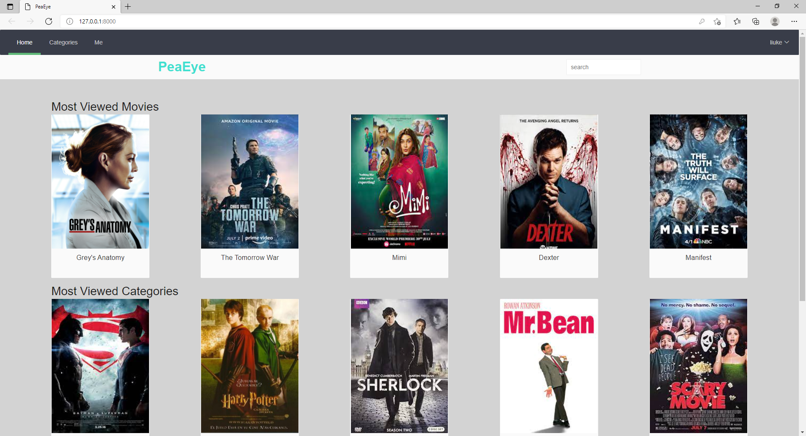
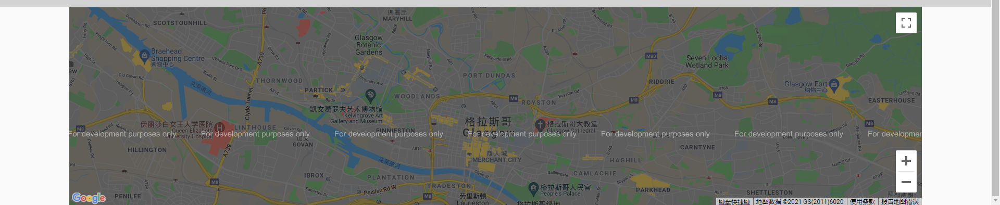
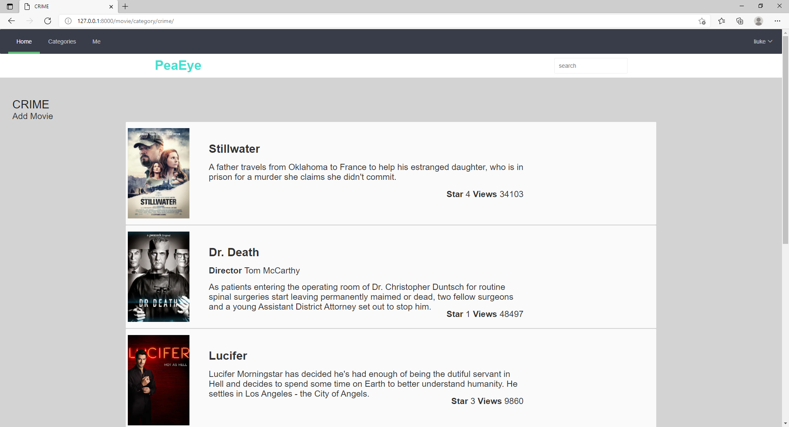
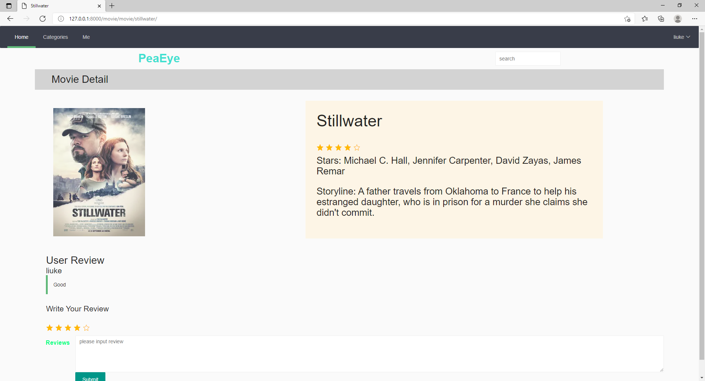
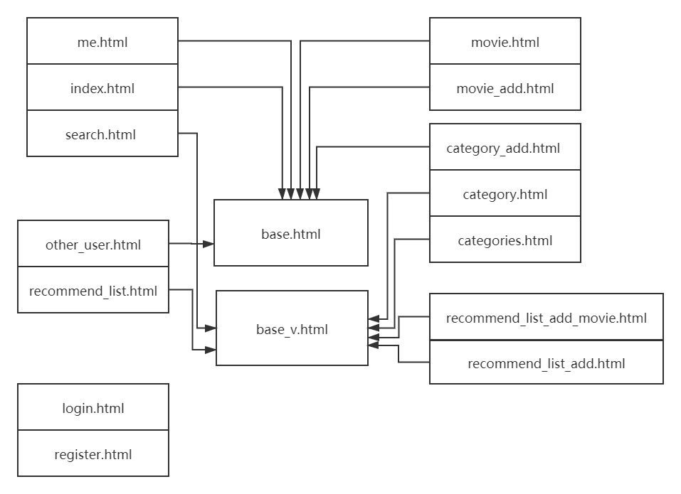

# Notice
This code do not contain database. IF you want to run, please follow:
```shell
python manage.py makemigrations movie
python manage.py migrate
```
Add super user: you need enter some information
```shell
python manage.py createsuperuser
```

Use this command add test data
```
python populate_rango.py
```


# PeaEye

This is a team work for class of Internet Technology In Computing in University of Glasgow.

This project based on Rango 

All .html file are extends from base.html or base_v.html, except register.html and login.html.


### HomePage




At homepage we can see the five most viewed movies and five most viewed categories. and we also use GoogleMap API show a map tp help user find a cinema

### Category


It show all movies in this category.  User can see movie's information and if this click a movie it will show detail for they chose.


### movie


It show movie detail and user's comment . user also can add a comment.

Those are part of pages we completed. we have pages for user to sign in and sing up,  and user's homepage and user's recommend list.


## HTML structure

All page are organized:


login.html and regester.html are independent.
